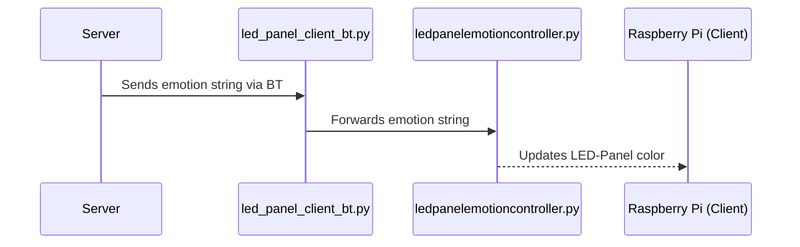

# EIES
Emotion Intent Evoking System

## Prerequisites

### rpi-rgb-led-64x64-matrix-py

- this is my fork of [rpi-rgb-led-matrix](https://github.com/hzeller/rpi-rgb-led-matrix)
- fixes to a 64x64 matrix
- some bug fixes

#### install

- install venv
- source it
- install cython
- in *rpi-rgb-led-64x64-matrix-py* -> ``` make build-python ```

### install libraries

- then run ``` poetry install ```

### Build-System Notes

- on my raspberry I only got an ancient poetry version, but poetry 2+ is needed
- did direct install from [Official Poetry Install Website](https://python-poetry.org/docs/#installing-with-the-official-installer)

## Server

The Server runs the Bluetooth Server and is contactable over REST.
It accepts a POST Json {LED: emotion}

## Client

On the Client (Raspi) that is LED-Panel enabled runs the 
- *led_panel_client_bt.py* -- manages the bt connection and forwards the emotion string
- *ledpanelemotioncontroller.py* -- gets the emotion string and sets the color of the LED-Panel accordingly


