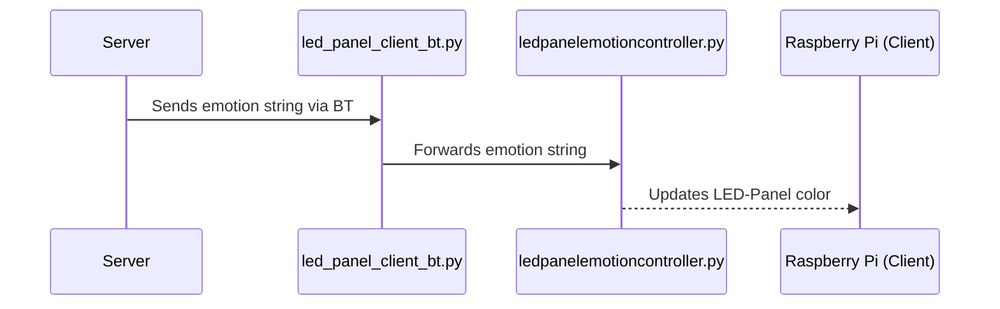

# EIES
Emotion Intent Evoking System

## Server

The Server runs the Bluetooth Server and is contactable over REST.
It accepts a POST Json {LED: emotion}

## Client

On the Client (Raspi) that is LED-Panel enabled runs the 
- *led_panel_client_bt.py* -- manages the bt connection and forwards the emotion string
- *ledpanelemotioncontroller.py* -- gets the emotion string and sets the color of the LED-Panel accordingly

